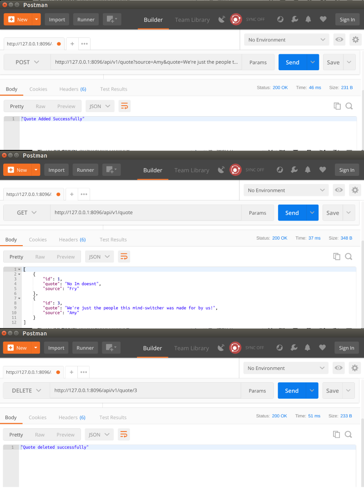

## Simple Quote API

 Made using [Symfony 3](https://symfony.com/)
 
 Code is based on the tutorial [A Simple RESTful API Tutorial with Symfony 3](https://andrewadcock.com/a-simple-restful-api-tutorial-with-symfony-3/)
 
 The code provides a simple API interface to add, update, and delete quotes.  
 
 Screenshot of application
 

 
 
## Clone this repo

`git clone https://github.com/mbrowniebytes/symfony-api-quote.git`

## Serve the project and visit 127.0.0.1:8096/api/v1/quote
 
 Configure Nginx using nginx-example.conf within /etc/nginx/sites-enabled/  
`vi nginx-example.conf`  
